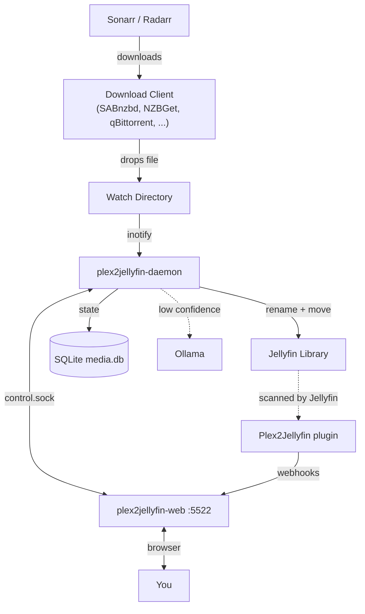

<div align="center">
  

  <p>Your Plex library, renamed the way Jellyfin wants it. Migrate once, then a daemon keeps every new download clean.</p>

  <p>
    <a href="https://nomadcxx.github.io/plex2jellyfin/docs/">Documentation</a>
    ·
    <a href="https://github.com/Nomadcxx/plex2jellyfin">GitHub</a>
  </p>
</div>

Plex papers over messy release names; Jellyfin takes your folders at face value. This tool migrates the files once (scan, dedupe, consolidate, rename), then `plex2jellyfin-daemon` watches download dirs and organizes every new arrival into Jellyfin naming. Out of scope: Plex accounts, watch state, ratings, and playlists.

## Installation

Every path ships the same binaries: CLI (`plex2jellyfin`), daemon, web UI on `:5522`, and the TUI installer. Config lives at `~/.config/plex2jellyfin/config.toml`.

### Option A — TUI installer

```bash
curl -sSL https://raw.githubusercontent.com/Nomadcxx/plex2jellyfin/main/install.sh | sudo bash
```

Interactive terminal wizard: watch paths, library paths, *arr keys, AI, permissions, and systemd units. Re-run to update; it preserves an existing `config.toml`.

<details>
<summary><b>Option B — Build from source + CLI setup</b></summary>

Requires Go 1.24+, git, npm, and sudo. Builds binaries, installs units, then you finish with the CLI wizard:

```bash
bash <(curl -fsSL https://raw.githubusercontent.com/Nomadcxx/plex2jellyfin/main/scripts/fresh-build-install.sh)
plex2jellyfin setup
```

</details>

<details>
<summary><b>Option C — Build from source + web setup</b></summary>

Same build/install as Option B, then enables `plex2jellyfin-web` and prints the wizard URL:

```bash
bash <(curl -fsSL https://raw.githubusercontent.com/Nomadcxx/plex2jellyfin/main/scripts/fresh-build-install-web.sh)
```

Open the URL the script prints (usually `http://127.0.0.1:5522/`), set an admin password, and walk through media paths, services, and review in the browser.

</details>

<details>
<summary><b>Option D — Docker</b></summary>

One image, three binaries: the daemon and web UI run together under the entrypoint, and the CLI is available for one-off commands (`docker run --rm <image> plex2jellyfin version`).

```yaml
services:
  plex2jellyfin:
    image: ghcr.io/nomadcxx/plex2jellyfin:latest
    container_name: plex2jellyfin
    environment:
      - PUID=1000
      - PGID=1000
    volumes:
      - ./config:/config
      - /path/to/downloads:/watch
      - /path/to/media:/library
    ports:
      - "5522:5522"
    restart: unless-stopped
```

```bash
docker compose -f docker-compose.example.yml up -d
```

`PUID`/`PGID` (linuxserver.io-style, default `1000:1000`) set the user everything runs as inside the container; `/config` is chowned to match on start. Set them to the UID/GID that should own files under `/library`.

The container runs as that non-root user, so the `[permissions]` chown feature has nothing to elevate to and is unavailable in-container. `PUID`/`PGID` replace it. The [Docker guide](https://nomadcxx.github.io/plex2jellyfin/docs/getting-started/docker/) covers SELinux and rootless setups.

</details>

<details>
<summary><b>Option E — Development</b></summary>

Requires Go 1.24+, git, and npm (for the embedded web UI):

```bash
git clone https://github.com/Nomadcxx/plex2jellyfin.git
cd plex2jellyfin
go build -o installer ./cmd/installer
sudo ./installer
```

Or build individual binaries with `go build -o plex2jellyfin ./cmd/plex2jellyfin` (and the matching `cmd/plex2jellyfin-daemon`, `cmd/plex2jellyfin-web` targets). For day-to-day UI work, see the docs [development](https://nomadcxx.github.io/plex2jellyfin/docs/) pages and `web/`.

</details>

<details>
<summary><b>Option F — AUR (Arch Linux)</b></summary>

Coming soon. Template package lives in [`packaging/aur/`](packaging/aur/) (`PKGBUILD` + `.install`); publish after the first `v0.x` tag.

</details>

<details>
<summary><b>Option G — Deb / RPM</b></summary>

Download the `.deb` or `.rpm` from [GitHub Releases](https://github.com/Nomadcxx/plex2jellyfin/releases/latest):

```bash
sudo apt install ./plex2jellyfin_*_amd64.deb      # Debian/Ubuntu
sudo dnf install ./plex2jellyfin-*.x86_64.rpm     # Fedora
```

Packages install binaries and systemd units but no config — finish in the web setup wizard. Point services at your user config once:

```bash
sudo systemctl edit plex2jellyfin-daemon
sudo systemctl edit plex2jellyfin-web
```

```ini
[Service]
Environment=SUDO_USER=<your username>
```

```bash
sudo systemctl enable --now plex2jellyfin-daemon plex2jellyfin-web
```

Then open `http://<host>:5522/`. Full walkthrough: [packages](https://nomadcxx.github.io/plex2jellyfin/docs/getting-started/packages/).

</details>

### Jellyfin Plugin — install this too

The companion plugin ([Nomadcxx/plex2jellyfin-plugin](https://github.com/Nomadcxx/plex2jellyfin-plugin)) is required for the feedback loop (item add/update/remove and playback → plex2jellyfin). Setup wizards can install it when you connect Jellyfin. Details: [plugin docs](https://nomadcxx.github.io/plex2jellyfin/docs/getting-started/jellyfin-plugin/).

## Screenshots

### Web

<p align="center">
  <video src="assets/showcase.mp4" controls width="800" poster="assets/showcase-poster.png">
    <a href="assets/showcase.mp4">Watch the showcase video</a>
  </video>
</p>

<p align="center">
  
</p>

<p align="center">
  
</p>

### TUI installer

<p align="center">
  <video src="assets/tui-installer.mp4" controls width="960" poster="assets/tui-installer-poster.png">
    <a href="assets/tui-installer.mp4">Watch the TUI installer</a>
  </video>
</p>

### CLI setup and scan

<p align="center">
  
</p>

## Architecture

| Binary | Role |
|---|---|
| `plex2jellyfin` | CLI — migration, setup, scan, duplicates, consolidate, plugin, status |
| `plex2jellyfin-daemon` | Watches download dirs, organizes arrivals, periodic scan, housekeeping; Unix control socket |
| `plex2jellyfin-web` | Dashboard + setup wizard on `:5522` (talks to the daemon over the socket) |
| Companion plugin | Inside Jellyfin — webhooks for item and playback events |

There is **no TCP** between web and daemon — only the Unix-domain control socket under `~/.config/plex2jellyfin/`.



More detail: [architecture](https://nomadcxx.github.io/plex2jellyfin/docs/reference/architecture/).

### Naming

**Movies:** `Movies/Movie Name (YYYY)/Movie Name (YYYY).ext`

**TV:** `TV Shows/Show Name (Year)/Season 01/Show Name (Year) S01E01.ext`

## License

GPL-3.0-or-later
