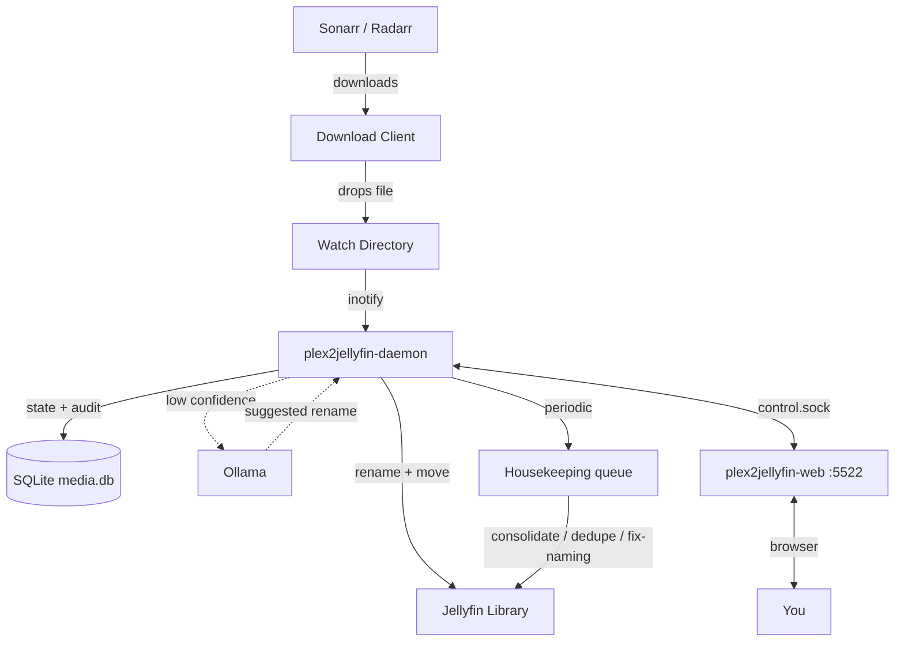

<div align="center">
  
</div>

---

> ⚠️ **WORK IN PROGRESS — NOT STABLE**
>
> This project is under active development. Features may change, break, or disappear without notice. Not recommended for production use. Use at your own risk.

---

Because Sonarr and Radarr can't be trusted with naming conventions.

## What It Does

Plex2Jellyfin watches download directories, parses media filenames, and renames files into a Jellyfin-compatible layout. `plex2jellyfin-web` serves a web dashboard at port `5522` for monitoring, queue management, duplicate review, and configuration. An optional Ollama integration handles ambiguous filenames with AI-assisted parsing.

```bash
curl -sSL https://raw.githubusercontent.com/Nomadcxx/plex2jellyfin/main/install.sh | sudo bash
```

## The Problem

Your *arr stack downloads `Show.Name.S01E01.1080p.WEB-DL.x264-RARBG.mkv`. Jellyfin wants `TV Shows/Show Name (2019)/Season 01/Show Name (2019) S01E01.mkv`. Plex2Jellyfin fixes that automatically, with AI fallback for ambiguous filenames and a convergence loop that catches files the parser missed.

## Architecture

Plex2Jellyfin ships **three** binaries:

| Binary | Role |
|---|---|
| `plex2jellyfin-daemon` | Background daemon. Watches download dirs, runs the periodic library scan, executes the housekeeping queue, and exposes a Unix-domain control socket at `~/.config/plex2jellyfin/control.sock`. |
| `plex2jellyfin-web` | HTTP server (default `:5522`). Hosts the embedded Next.js dashboard and proxies API calls to `plex2jellyfin-daemon` over the control socket. |
| `plex2jellyfin` | CLI for one-shot scans, audits, organize/move operations, duplicate cleanup, and consolidation. |



See [`docs/architecture.md`](docs/architecture.md) for details.

## CLI Commands

`plex2jellyfin --help` shows the primary workflows. Advanced and maintenance commands are available but hidden from the root help to keep it focused.

### Primary Commands

```bash
plex2jellyfin scan                          # Index libraries into media.db
plex2jellyfin status                        # DB statistics and deployment health
plex2jellyfin duplicates generate           # Find duplicate media
plex2jellyfin duplicates dry-run            # Preview deletion plan
plex2jellyfin duplicates execute            # Keep the best copy, remove the rest
plex2jellyfin consolidate generate          # Find TV series scattered across drives
plex2jellyfin consolidate dry-run           # Preview consolidation moves
plex2jellyfin consolidate execute           # Merge into a single library path
plex2jellyfin config                        # Manage configuration
plex2jellyfin version                       # Print version information
```

### AI Audit

Reviews files with low parse confidence and proposes renames via the configured LLM:

```bash
plex2jellyfin audit --generate             # Identify low-confidence files
plex2jellyfin audit --generate --dry-run   # Preview AI rename suggestions
plex2jellyfin audit --execute              # Apply approved fixes
```

The audit sends the library kind (Movies vs TV), folder path, and current parse as context to the LLM. See [`docs/ai-context.md`](docs/ai-context.md).

### Duplicates & Consolidation

The daemon runs a convergence loop that detects duplicates and scattered series, feeding them into the housekeeping queue. You can see the queue in the web UI at `/scheduler`. The CLI commands above handle one-off manual maintenance.

### Advanced Commands (hidden from root help)

```bash
plex2jellyfin organize /downloads/file.mkv  # Organize a single file
plex2jellyfin organize-folder /downloads/X  # Organize a directory tree
plex2jellyfin watch /downloads              # Foreground watcher
plex2jellyfin validate <path>              # Check library against Jellyfin naming rules
plex2jellyfin cleanup                      # Remove cruft files / empty dirs
plex2jellyfin monitor                      # Tail plex2jellyfin-daemon activity log
plex2jellyfin daemon {start|stop|restart}  # Control the systemd service
plex2jellyfin serve                        # Run the API server in foreground
plex2jellyfin repair series-dedupe         # Repair duplicate series rows
plex2jellyfin database cleanup-housekeeping # Collapse duplicate housekeeping rows
plex2jellyfin postmortem collect --since 96h # Generate evidence bundle for review
plex2jellyfin sonarr ...                   # Sonarr integration commands
plex2jellyfin radarr ...                   # Radarr integration commands
plex2jellyfin health                       # Verify *arr setup is compatible
plex2jellyfin migrate                      # Reconcile DB paths against *arr current state
plex2jellyfin orphans                      # Detect / remediate orphaned Jellyfin episodes
plex2jellyfin parses                       # Query parse_decisions table
```

## Web Dashboard

`plex2jellyfin-web` serves the dashboard at `http://<host>:5522/`. Routes:

- `/` — overview (media counts, duplicate groups, recent activity)
- `/queue` — current move queue
- `/scheduler` — periodic jobs + housekeeping task list (pending / running / flagged / failed / done)
- `/duplicates` — duplicate groups awaiting review
- `/consolidation` — TV consolidation plans
- `/activity` — daemon activity stream
- `/jellyfin` — Jellyfin connection + path-mapping status
- `/onboarding`, `/login`, `/settings/*` — first-run and configuration

Every settings page maps to a section of `~/.config/plex2jellyfin/config.toml`.

## Naming Rules

**Movies:** `Movies/Movie Name (YYYY)/Movie Name (YYYY).ext`

**TV Shows:** `TV Shows/Show Name (Year)/Season 01/Show Name (Year) S01E01.ext`

The parser strips release-group noise (`1080p`, `x264`, `WEB-DL`, `RARBG`, `-YTS`, etc.). It also extracts resolution, source, and HDR from the parent directory when the filename lacks them, so quality grouping works on legacy libraries.

## Configuration

Config file: `~/.config/plex2jellyfin/config.toml`. A full annotated template is in [`config.toml.example`](config.toml.example).

```toml
[watch]
movies = ["/downloads/movies"]
tv     = ["/downloads/tv"]

[libraries]
movies = ["/media/Movies"]
tv     = ["/media/TV Shows"]

[daemon]
enabled        = true
scan_frequency = "5m"
health_addr    = ":8686"

[ai]
enabled              = true
ollama_endpoint      = "http://localhost:11434"
model                = "minimax-m2.5:cloud"
fallback_model       = "kimi-k2.6:cloud"
confidence_threshold = 0.8
auto_trigger_threshold = 0.6
timeout_seconds      = 30
cache_enabled        = true
auto_resolve_risky   = false
max_retries          = 3
hourly_limit         = 10
daily_limit          = 50

[options]
dry_run          = false
delete_source    = true
```

### Sonarr / Radarr

```toml
[sonarr]
enabled          = true
url              = "http://localhost:8989"
api_key          = "..."
notify_on_import = true

[radarr]
enabled          = true
url              = "http://localhost:7878"
api_key          = "..."
notify_on_import = true
```

### Jellyfin path mappings

When Jellyfin runs in a container with bind mounts, configure path mappings so the post-organize feedback loop can correlate Jellyfin items with daemon paths:

```toml
[jellyfin]
enabled        = true
url            = "http://localhost:8096"
api_key        = "..."
webhook_secret = "..."

[[jellyfin.path_mappings]]
jellyfin = "/tv5"
daemon   = "/mnt/STORAGE5/TVSHOWS"
```

Without these, the sweeper labels parse-decision rows for organized files as FAIL.

### File Permissions

If Jellyfin runs as a different user, set ownership on moved files:

```toml
[permissions]
user      = "jellyfin"
group     = "jellyfin"
file_mode = "0644"
dir_mode  = "0755"
```

> **Note:** `plex2jellyfin-daemon` must run as root to chown files. The bundled systemd unit drops to a minimal capability set: `CAP_CHOWN`, `CAP_FOWNER`, `CAP_DAC_OVERRIDE`.

## Services

The installer registers three systemd units:

```bash
systemctl status plex2jellyfin-daemon              # daemon
systemctl status plex2jellyfin-web                # web UI on :5522
systemctl --user status plex2jellyfin-postmortem.timer  # scheduled evidence collection
journalctl -u plex2jellyfin-daemon -f
```

`plex2jellyfin-web` depends on `plex2jellyfin-daemon` and reaches it via the Unix-domain control socket. No TCP between them.

The postmortem timer runs every 4 days, collecting parse decisions, repair events, housekeeping state, and suspicious items into an evidence bundle at `~/.config/plex2jellyfin/reports/latest/`. It opens a terminal with an `agent-prompt.md` for periodic human or LLM review.

## Install

**One-liner:**

```bash
curl -sSL https://raw.githubusercontent.com/Nomadcxx/plex2jellyfin/main/install.sh | sudo bash
```

**Manual:**

```bash
git clone https://github.com/Nomadcxx/plex2jellyfin.git
cd plex2jellyfin
go build -o installer ./cmd/installer
sudo ./installer
```

The installer walks you through watch paths, library paths, *arr keys, AI, permissions, and systemd units. You can re-run it to update without losing your existing `config.toml`.

Requires **Go 1.24+** (see `go.mod`).

## Building from source

```bash
make                                       # build all binaries into bin/
go build -o bin/plex2jellyfin-daemon ./cmd/plex2jellyfin-daemon
go build -o bin/plex2jellyfin-web    ./cmd/plex2jellyfin-web
go build -o bin/plex2jellyfin  ./cmd/plex2jellyfin
cd web && npm run build                    # rebuild dashboard (embedded into plex2jellyfin-web)
./test-all.sh                              # full test sweep
```

## License

GPL-3.0 or later
