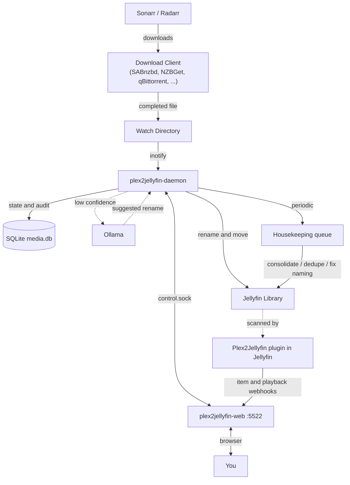

<div align="center">
  

  <p>
    
    
    
  </p>

  <p>Plex papers over messy release names. Jellyfin reads your folders at face value.</p>

  <p><code>plex2jellyfin</code> cleans an existing media library, then keeps new downloads in Jellyfin naming.</p>

  <p>
    <a href="https://nomadcxx.github.io/plex2jellyfin/docs/">Documentation</a>
    ·
    <a href="https://github.com/Nomadcxx/plex2jellyfin">GitHub</a>
  </p>
</div>

## Plex to Jellyfin

Run a migration pass when you move a library over from Plex. The CLI indexes your movie and TV roots, reports library health, finds duplicates, consolidates TV series split across drives, and prepares rename or delete plans for review.

Keep the daemon running after the first pass. It watches download folders, parses release names, strips scene tags, creates Jellyfin-style movie and TV folders, and moves new arrivals into the configured libraries.

The web UI gives you setup, dashboard, queue, activity, trace, scheduler, duplicate review, consolidation, and settings screens on port `5522`.

## Safety

Cleanup commands use a plan-first flow:

```bash
generate -> dry-run -> execute
```

`generate` writes a plan. `dry-run` prints the moves or deletes. `execute` applies the plan you reviewed.

The daemon organizes new arrivals for real. Use watch paths that contain completed downloads, not folders still owned by your download client.

## Install

Each install path provides the same pieces:

| Piece | Role |
| --- | --- |
| `plex2jellyfin` | CLI for setup, scan, duplicates, consolidate, plugin, status |
| `plex2jellyfin-daemon` | Watches download dirs, organizes arrivals, runs periodic scans |
| `plex2jellyfin-web` | Dashboard and setup wizard on `:5522` |
| TUI installer | Terminal setup for paths, services, permissions, AI, systemd |

Config lives at `~/.config/plex2jellyfin/config.toml`.

### TUI installer

```bash
curl -sSL https://raw.githubusercontent.com/Nomadcxx/plex2jellyfin/main/install.sh | sudo bash
```

The installer builds and installs the binaries, walks through paths and service settings, and preserves an existing `config.toml` when you rerun it.

<details>
<summary><b>Build from source, then run CLI setup</b></summary>

Requires Go 1.25+, git, npm, and sudo.

```bash
bash <(curl -fsSL https://raw.githubusercontent.com/Nomadcxx/plex2jellyfin/main/scripts/fresh-build-install.sh)
plex2jellyfin setup
```

</details>

<details>
<summary><b>Build from source, then run web setup</b></summary>

Same build path as CLI setup, then starts `plex2jellyfin-web` and prints the setup URL.

```bash
bash <(curl -fsSL https://raw.githubusercontent.com/Nomadcxx/plex2jellyfin/main/scripts/fresh-build-install-web.sh)
```

Open the printed URL, set an admin password, and finish media paths, services, and review in the browser.

</details>

<details>
<summary><b>Docker</b></summary>

One image contains the daemon, web UI, and CLI.

```yaml
services:
  plex2jellyfin:
    image: ghcr.io/nomadcxx/plex2jellyfin:latest
    container_name: plex2jellyfin
    environment:
      - PUID=1000
      - PGID=1000
    volumes:
      - ./config:/config
      - /path/to/downloads:/watch
      - /path/to/media:/library
    ports:
      - "5522:5522"
    restart: unless-stopped
```

```bash
docker compose -f docker-compose.example.yml up -d
```

Set `PUID` and `PGID` to the user that should own files under `/library`. The container drops to that user before it starts the daemon and web UI, so `[permissions]` chown settings have no effect inside Docker.

The [Docker guide](https://nomadcxx.github.io/plex2jellyfin/docs/getting-started/docker/) covers SELinux, rootless Podman, and multi-drive mounts.

</details>

<details>
<summary><b>AUR on Arch Linux</b></summary>

```bash
yay -S plex2jellyfin
# or
paru -S plex2jellyfin
```

The package installs binaries and systemd units. Finish with the web or CLI setup wizard.

</details>

<details>
<summary><b>Development checkout</b></summary>

Requires Go 1.25+, git, and npm.

```bash
git clone https://github.com/Nomadcxx/plex2jellyfin.git
cd plex2jellyfin
go build -o installer ./cmd/installer
sudo ./installer
```

For individual binaries:

```bash
go build -o plex2jellyfin ./cmd/plex2jellyfin
go build -o plex2jellyfin-daemon ./cmd/plex2jellyfin-daemon
go build -o plex2jellyfin-web ./cmd/plex2jellyfin-web
```

Frontend work lives in `web/`. The release build embeds the exported frontend into the Go binary.

</details>

## Migration Pass

Run this once after setup when you want to clean an existing library:

```bash
plex2jellyfin scan
plex2jellyfin status
plex2jellyfin duplicates generate
plex2jellyfin duplicates dry-run
plex2jellyfin duplicates execute
plex2jellyfin consolidate generate
plex2jellyfin consolidate dry-run
plex2jellyfin consolidate execute
plex2jellyfin audit --generate
plex2jellyfin audit --generate --dry-run
plex2jellyfin audit --execute
```

Skip a stage if it does not fit your library. For example, single-drive TV libraries may not need consolidation.

`audit` reviews low-confidence parses and can ask Ollama for rename suggestions. It sends library kind, folder path, and current parse data. It does not send raw media contents.

## Companion Plugin

The organizer can move files without the plugin. The full feedback loop needs it.

The companion plugin, [Nomadcxx/plex2jellyfin-plugin](https://github.com/Nomadcxx/plex2jellyfin-plugin), runs inside Jellyfin and sends item, removal, and playback events back to plex2jellyfin. With those events, plex2jellyfin can confirm Jellyfin recognized organized files, attach Jellyfin item IDs, detect orphaned media, and avoid moving files during playback.

Setup wizards install and configure the plugin when you connect Jellyfin. Existing installs can run:

```bash
plex2jellyfin plugin install
plex2jellyfin plugin verify
```

If Jellyfin reports container paths that differ from your host paths, configure [path mappings](https://nomadcxx.github.io/plex2jellyfin/docs/getting-started/path-mappings/). Without mappings, Jellyfin events cannot match moved files, so confirmation and orphan detection will miss items.

## Runtime Pieces

| Piece | Runs where | Responsibility |
| --- | --- | --- |
| CLI | foreground | Setup, scan, migration, repair, status |
| Daemon | systemd or container | Watch dirs, organize files, periodic scans, housekeeping |
| Web UI | `:5522` | Browser dashboard and setup |
| Plugin | Jellyfin | Webhooks for item and playback events |
| SQLite DB | config dir | Indexed files, parse decisions, traces, housekeeping |

The web UI talks to the daemon through a Unix-domain socket under `~/.config/plex2jellyfin/`. It does not use TCP for web-to-daemon control.



More detail: [architecture](https://nomadcxx.github.io/plex2jellyfin/docs/reference/architecture/).

## Naming

Movies:

```text
Movies/Movie Name (YYYY)/Movie Name (YYYY).ext
```

TV:

```text
TV Shows/Show Name (Year)/Season 01/Show Name (Year) S01E01.ext
```

The parser removes release-group noise such as `1080p`, `x264`, `WEB-DL`, `RARBG`, and `-YTS`. It also reads resolution, source, and HDR tags from the parent directory when the filename lacks them, which helps quality scoring on older libraries.

| Incoming | Organized |
| --- | --- |
| `Show.Name.S01E01.1080p.WEB-DL.x264-RARBG.mkv` | `TV Shows/Show Name (2019)/Season 01/Show Name (2019) S01E01.mkv` |
| `Movie.Title.2020.2160p.BluRay.x265-GROUP.mkv` | `Movies/Movie Title (2020)/Movie Title (2020).mkv` |

## Config

Generate a starter config with:

```bash
plex2jellyfin config init
```

Annotated template: [`config.toml.example`](config.toml.example). Full reference: [configuration docs](https://nomadcxx.github.io/plex2jellyfin/docs/reference/configuration/).

```toml
[watch]
movies = ["/downloads/movies"]
tv     = ["/downloads/tv"]

[libraries]
movies = ["/media/Movies"]
tv     = ["/media/TV Shows"]

[daemon]
enabled        = true
scan_frequency = "5m"
```

<details>
<summary><b>Sonarr and Radarr</b></summary>

```toml
[sonarr]
enabled          = true
url              = "http://localhost:8989"
api_key          = "..."
notify_on_import = true

[radarr]
enabled          = true
url              = "http://localhost:7878"
api_key          = "..."
notify_on_import = true
```

</details>

<details>
<summary><b>Jellyfin path mappings</b></summary>

Use mappings when Jellyfin reports paths that differ from the daemon view. Docker bind mounts often need this.

```toml
[jellyfin]
enabled        = true
url            = "http://localhost:8096"
api_key        = "..."
webhook_secret = "..."

[[jellyfin.path_mappings]]
jellyfin = "/tv"
daemon   = "/mnt/storage1/TVSHOWS"
```

</details>

<details>
<summary><b>File permissions on bare metal</b></summary>

Set ownership on moved files when Jellyfin runs as a different user:

```toml
[permissions]
user      = "jellyfin"
group     = "jellyfin"
file_mode = "0644"
dir_mode  = "0755"
```

The bundled systemd unit gives `plex2jellyfin-daemon` the permissions it needs for `chown`. In Docker, set `PUID` and `PGID` instead.

</details>

<details>
<summary><b>Optional AI naming assist</b></summary>

```toml
[ai]
enabled              = false
ollama_endpoint      = "http://localhost:11434"
model                = "qwen2.5vl:7b"
confidence_threshold = 0.8
```

</details>

## Screenshots

### Dashboard

<p align="center">
  
</p>

### Setup

<p align="center">
  
</p>

### Consolidation

<p align="center">
  
</p>

### Scheduler

<p align="center">
  
</p>

## License

GPL-3.0-or-later
