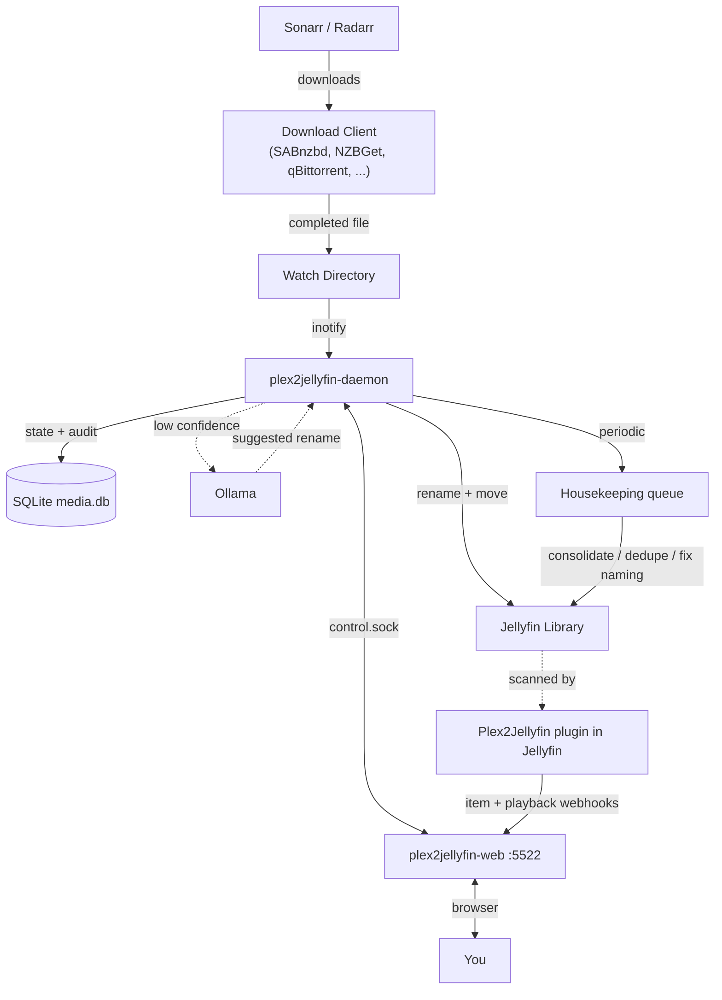
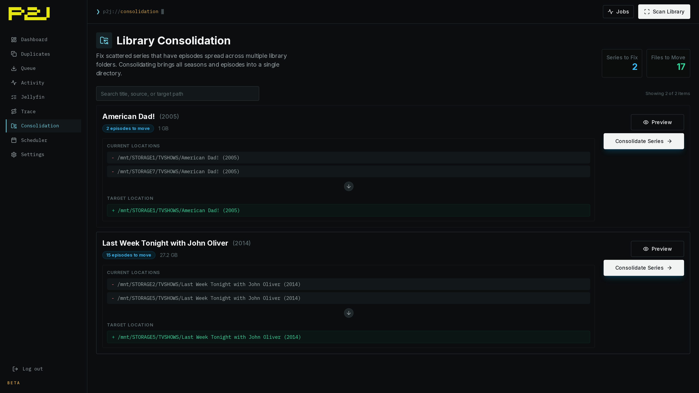
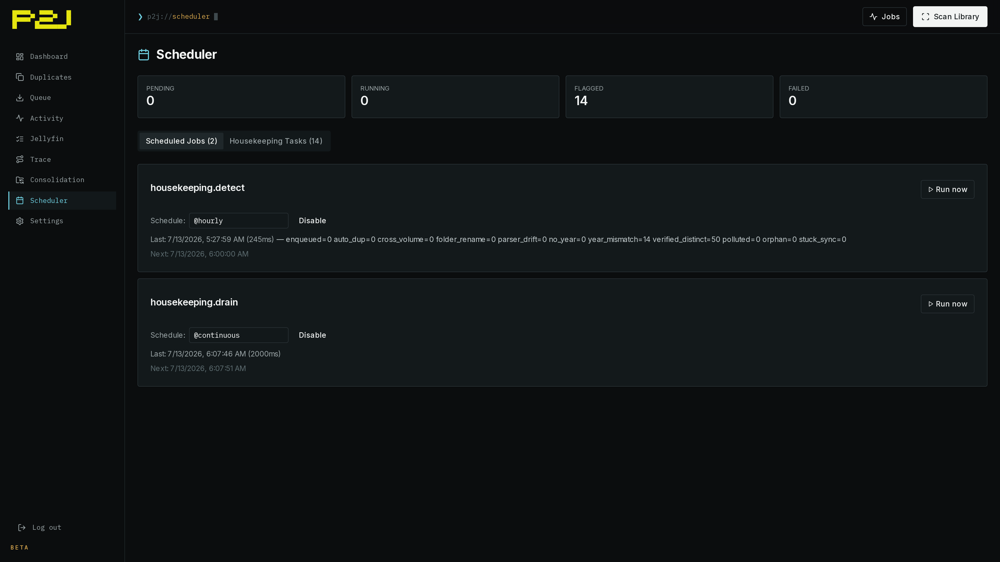

<div align="center">
  

  <p>
    
    
    
  </p>

  <p>Plex can hide messy filenames. Jellyfin works best with clean folders.</p>

  <p>Scan, dedupe, consolidate, and rename your existing library. Then let <code>plex2jellyfin-daemon</code> organize new downloads as they arrive.</p>

  <p>
    <a href="https://nomadcxx.github.io/plex2jellyfin/docs/">Documentation</a>
    ·
    <a href="https://github.com/Nomadcxx/plex2jellyfin">GitHub</a>
  </p>
</div>

## Installation

Each install path ships the same pieces:

| Binary | Role |
| --- | --- |
| `plex2jellyfin` | CLI: setup, scan, duplicates, consolidate, plugin, status |
| `plex2jellyfin-daemon` | Watches download dirs, organizes arrivals, runs periodic scans |
| `plex2jellyfin-web` | Dashboard and setup wizard on `:5522` |
| TUI installer | Terminal setup for paths, services, permissions, AI, systemd |

Config lives at `~/.config/plex2jellyfin/config.toml`.

### Option A - TUI installer

```bash
curl -sSL https://raw.githubusercontent.com/Nomadcxx/plex2jellyfin/main/install.sh | sudo bash
```

Interactive terminal wizard for watch paths, library paths, *arr keys, Jellyfin, AI, permissions, and systemd units. Re-run it to update; it preserves `config.toml`.

<details>
<summary><b>Option B - Build from source + CLI setup</b></summary>

Requires Go 1.25+, git, npm, and sudo.

```bash
bash <(curl -fsSL https://raw.githubusercontent.com/Nomadcxx/plex2jellyfin/main/scripts/fresh-build-install.sh)
plex2jellyfin setup
```

</details>

<details>
<summary><b>Option C - Build from source + web setup</b></summary>

Same build path as Option B, then starts `plex2jellyfin-web` and prints the wizard URL.

```bash
bash <(curl -fsSL https://raw.githubusercontent.com/Nomadcxx/plex2jellyfin/main/scripts/fresh-build-install-web.sh)
```

Open the printed URL, set an admin password, and finish setup in the browser.

</details>

<details>
<summary><b>Option D - Docker</b></summary>

```yaml
services:
  plex2jellyfin:
    image: ghcr.io/nomadcxx/plex2jellyfin:latest
    container_name: plex2jellyfin
    environment:
      - PUID=1000
      - PGID=1000
    volumes:
      - ./config:/config
      - /path/to/downloads:/watch
      - /path/to/media:/library
    ports:
      - "5522:5522"
    restart: unless-stopped
```

```bash
docker compose -f docker-compose.example.yml up -d
```

Set `PUID`/`PGID` to the UID/GID that should own files under `/library`. In Docker, `[permissions]` chown settings have no effect; use `PUID`/`PGID` instead.

See the [Docker guide](https://nomadcxx.github.io/plex2jellyfin/docs/getting-started/docker/) for SELinux, rootless Podman, and multi-drive mounts.

</details>

<details>
<summary><b>Option E - AUR (Arch Linux)</b></summary>

```bash
yay -S plex2jellyfin
# or: paru -S plex2jellyfin
```

Installs binaries and systemd units. Finish with the web or CLI setup wizard.

</details>

<details>
<summary><b>Option F - Development</b></summary>

Requires Go 1.25+, git, and npm.

```bash
git clone https://github.com/Nomadcxx/plex2jellyfin.git
cd plex2jellyfin
go build -o installer ./cmd/installer
sudo ./installer
```

Or build individual binaries:

```bash
go build -o plex2jellyfin ./cmd/plex2jellyfin
go build -o plex2jellyfin-daemon ./cmd/plex2jellyfin-daemon
go build -o plex2jellyfin-web ./cmd/plex2jellyfin-web
```

Frontend work lives in `web/`.

</details>

## Migration

Run the one-shot cleanup pass after setup:

```bash
plex2jellyfin scan
plex2jellyfin status
plex2jellyfin duplicates generate
plex2jellyfin duplicates dry-run
plex2jellyfin duplicates execute
plex2jellyfin consolidate generate
plex2jellyfin consolidate dry-run
plex2jellyfin consolidate execute
plex2jellyfin audit --generate
plex2jellyfin audit --generate --dry-run
plex2jellyfin audit --execute
```

Destructive commands follow `generate -> dry-run -> execute`. Read the dry-run before you execute.

`audit` is optional. It reviews low-confidence parses and can ask Ollama for rename suggestions.

## Jellyfin Plugin

The companion plugin ([Nomadcxx/plex2jellyfin-plugin](https://github.com/Nomadcxx/plex2jellyfin-plugin)) is required for the full feedback loop. It forwards item-added, item-updated, item-removed, and playback events from Jellyfin so plex2jellyfin can confirm moved files, detect orphans, and avoid moving active playback.

Setup wizards install and configure it when you connect Jellyfin. Existing installs can run:

```bash
plex2jellyfin plugin install
plex2jellyfin plugin verify
```

If Jellyfin paths differ from host library roots, configure [path mappings](https://nomadcxx.github.io/plex2jellyfin/docs/getting-started/path-mappings/).

## Architecture

| Binary | Role |
| --- | --- |
| `plex2jellyfin` | CLI: migration, setup, scan, duplicates, consolidate, plugin, status |
| `plex2jellyfin-daemon` | Watches download dirs, organizes arrivals, periodic scan, housekeeping |
| `plex2jellyfin-web` | Dashboard + setup wizard on `:5522` |
| Companion plugin | Runs inside Jellyfin; sends item and playback webhooks |

Web and daemon communicate over the Unix-domain control socket under `~/.config/plex2jellyfin/`.



More detail: [architecture](https://nomadcxx.github.io/plex2jellyfin/docs/reference/architecture/).

## Naming Rules

**Movies:** `Movies/Movie Name (YYYY)/Movie Name (YYYY).ext`

**TV Shows:** `TV Shows/Show Name (Year)/Season 01/Show Name (Year) S01E01.ext`

The parser strips scene/release noise (`1080p`, `x264`, `WEB-DL`, `RARBG`, `-YTS`, etc.), keeps title words that look like noise (`All`, `IT`, `Her`, `Rome`), and reads quality tags from parent folders when filenames lack them.

| Incoming file | Parsed result |
| --- | --- |
| `Breaking.Bad.S01E01.1080p.WEB-DL.DDP5.1.H.264-FLUX.mkv` | `Breaking Bad` / `S01E01`; strips codec, audio, source, release group |
| `Worst.Ex.Ever.S02E01.2026.1080p.NF.WEB-DL.DDP5.1.Atmos.H.264-HDSWEB.mkv` | `Worst Ex Ever` / `S02E01`; ignores the post-episode release year |
| `The.Daily.Show.2026.04.20.Annalena.Baerbock.1080p.WEB.h264-EDITH.mkv` | `The Daily Show` / date episode `2026-04-20` |
| `Bones.And.All.2022.2160p.4K.WEB.x265.10bit.AAC5.1-YTS.MX.mkv` | `Bones And All (2022)`; keeps `All` as title text |
| `Blade.Runner.2049.2017.1080p.BluRay.x264.mkv` | `Blade Runner 2049 (2017)`; keeps the title number separate from the year |
| `U.S.Marshals.1998.1080p.BluRay.x264-SPARKS.mkv` | `U.S. Marshals (1998)`; keeps abbreviation punctuation |
| `fast.five.2011.1080p.pcok.web-dl.ddp.5.1.h.264-pirates.mkv` | `Fast Five (2011)`; strips streaming-source tags such as `PCOK` |
| `One.Mile.Chapter.Two.2026.1080p.TOD.WEB-DL.EN-TR.AAC2.0.H.264-TURG.mkv` | `One Mile Chapter Two (2026)`; strips language and source tags |
| `Triple.Frontier.2019.1080p.NF.WEB-DL.H.264.DUAL.EAC5.1-TSRG.mkv` | `Triple Frontier (2019)`; handles shorthand audio tags |
| `2.Guns.2013.1080p.BluRay.OPUS5.1.AV1-YorMama.mkv` | `2 Guns (2013)`; handles title-leading numbers and modern codecs |

## Configuration

Config lives at `~/.config/plex2jellyfin/config.toml`. Generate a starter file with:

```bash
plex2jellyfin config init
```

Annotated template: [`config.toml.example`](config.toml.example). Full reference: [configuration docs](https://nomadcxx.github.io/plex2jellyfin/docs/reference/configuration/).

```toml
[watch]
movies = ["/downloads/movies"]
tv     = ["/downloads/tv"]

[libraries]
movies = ["/media/Movies"]
tv     = ["/media/TV Shows"]

[daemon]
enabled        = true
scan_frequency = "5m"
```

<details>
<summary><b>Common extras</b></summary>

```toml
[sonarr]
enabled          = true
url              = "http://localhost:8989"
api_key          = "..."
notify_on_import = true

[radarr]
enabled          = true
url              = "http://localhost:7878"
api_key          = "..."
notify_on_import = true

[jellyfin]
enabled        = true
url            = "http://localhost:8096"
api_key        = "..."
webhook_secret = "..."

[[jellyfin.path_mappings]]
jellyfin = "/tv"
daemon   = "/mnt/storage1/TVSHOWS"

[permissions]
user      = "jellyfin"
group     = "jellyfin"
file_mode = "0644"
dir_mode  = "0755"
```

</details>

## Screenshots

### Dashboard

<p align="center">
  
</p>

### Setup

<p align="center">
  
</p>

### Consolidation

<p align="center">
  
</p>

### Scheduler

<p align="center">
  
</p>

## License

GPL-3.0-or-later
