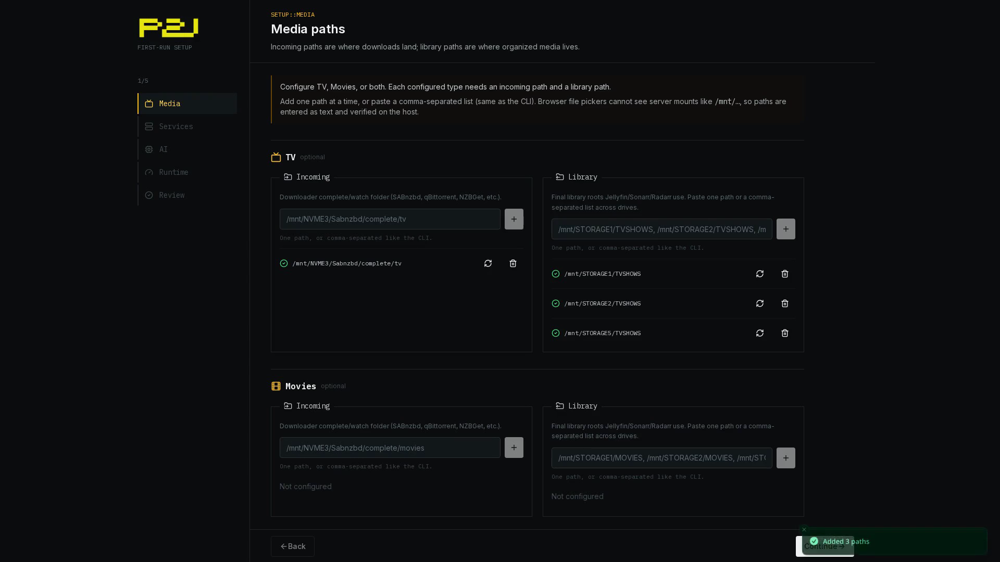
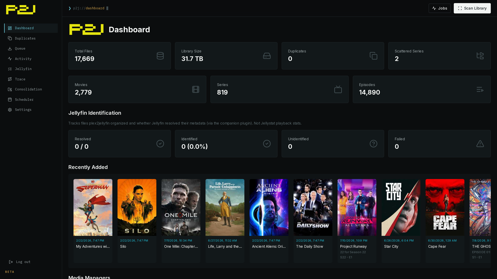
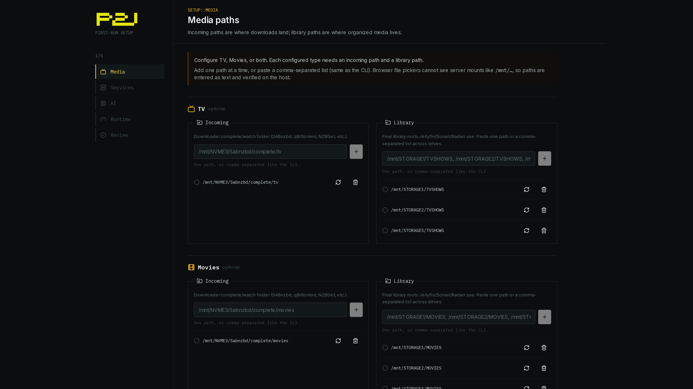

<div align="center">
  

  <p>
    
    
  </p>

  <p>Plex papers over messy release names; Jellyfin takes your folders at face value. This tool migrates the files once (scan, dedupe, consolidate, rename), then <code>plex2jellyfin-daemon</code> watches download dirs and organizes every new arrival into Jellyfin naming. Out of scope: Plex accounts, watch state, ratings, and playlists.</p>

  <p>
    <a href="https://nomadcxx.github.io/plex2jellyfin/docs/">Documentation</a>
    ·
    <a href="https://github.com/Nomadcxx/plex2jellyfin">GitHub</a>
  </p>
</div>

## Installation

Every path ships the same binaries: CLI (`plex2jellyfin`), daemon, web UI on `:5522`, and the TUI installer. Config lives at `~/.config/plex2jellyfin/config.toml`.

### Option A — TUI installer

```bash
curl -sSL https://raw.githubusercontent.com/Nomadcxx/plex2jellyfin/main/install.sh | sudo bash
```

Interactive terminal wizard: watch paths, library paths, *arr keys, AI, permissions, and systemd units. Re-run to update; it preserves an existing `config.toml`.

<details>
<summary><b>Option B — Build from source + CLI setup</b></summary>

Requires Go 1.24+, git, npm, and sudo. Builds binaries, installs units, then you finish with the CLI wizard:

```bash
bash <(curl -fsSL https://raw.githubusercontent.com/Nomadcxx/plex2jellyfin/main/scripts/fresh-build-install.sh)
plex2jellyfin setup
```

</details>

<details>
<summary><b>Option C — Build from source + web setup</b></summary>

Same build/install as Option B, then enables `plex2jellyfin-web` and prints the wizard URL:

```bash
bash <(curl -fsSL https://raw.githubusercontent.com/Nomadcxx/plex2jellyfin/main/scripts/fresh-build-install-web.sh)
```

Open the URL the script prints (usually `http://127.0.0.1:5522/`), set an admin password, and walk through media paths, services, and review in the browser.

</details>

<details>
<summary><b>Option D — Docker</b></summary>

One image, three binaries: the daemon and web UI run together under the entrypoint, and the CLI is available for one-off commands (`docker run --rm <image> plex2jellyfin version`).

```yaml
services:
  plex2jellyfin:
    image: ghcr.io/nomadcxx/plex2jellyfin:latest
    container_name: plex2jellyfin
    environment:
      - PUID=1000
      - PGID=1000
    volumes:
      - ./config:/config
      - /path/to/downloads:/watch
      - /path/to/media:/library
    ports:
      - "5522:5522"
    restart: unless-stopped
```

```bash
docker compose -f docker-compose.example.yml up -d
```

`PUID`/`PGID` (linuxserver.io-style, default `1000:1000`) set the user everything runs as inside the container; `/config` is chowned to match on start. Set them to the UID/GID that should own files under `/library`.

The container runs as that non-root user, so the `[permissions]` chown feature has nothing to elevate to and is unavailable in-container. `PUID`/`PGID` replace it. The [Docker guide](https://nomadcxx.github.io/plex2jellyfin/docs/getting-started/docker/) covers SELinux and rootless setups.

</details>

<details>
<summary><b>Option E — Development</b></summary>

Requires Go 1.24+, git, and npm (for the embedded web UI):

```bash
git clone https://github.com/Nomadcxx/plex2jellyfin.git
cd plex2jellyfin
go build -o installer ./cmd/installer
sudo ./installer
```

Or build individual binaries with `go build -o plex2jellyfin ./cmd/plex2jellyfin` (and the matching `cmd/plex2jellyfin-daemon`, `cmd/plex2jellyfin-web` targets). For day-to-day UI work, see the docs [development](https://nomadcxx.github.io/plex2jellyfin/docs/) pages and `web/`.

</details>

<details>
<summary><b>Option F — AUR (Arch Linux)</b></summary>

Coming soon. Template package lives in [`packaging/aur/`](packaging/aur/) (`PKGBUILD` + `.install`); publish after the first `v0.x` tag.

</details>

<details>
<summary><b>Option G — Deb / RPM</b></summary>

Download the `.deb` or `.rpm` from [GitHub Releases](https://github.com/Nomadcxx/plex2jellyfin/releases/latest):

```bash
sudo apt install ./plex2jellyfin_*_amd64.deb      # Debian/Ubuntu
sudo dnf install ./plex2jellyfin-*.x86_64.rpm     # Fedora
```

Packages install binaries and systemd units but no config — finish in the web setup wizard. Point services at your user config once:

```bash
sudo systemctl edit plex2jellyfin-daemon
sudo systemctl edit plex2jellyfin-web
```

```ini
[Service]
Environment=SUDO_USER=<your username>
```

```bash
sudo systemctl enable --now plex2jellyfin-daemon plex2jellyfin-web
```

Then open `http://<host>:5522/`. Full walkthrough: [packages](https://nomadcxx.github.io/plex2jellyfin/docs/getting-started/packages/).

</details>

### Jellyfin Plugin — install this too

The companion plugin ([Nomadcxx/plex2jellyfin-plugin](https://github.com/Nomadcxx/plex2jellyfin-plugin)) is required for the feedback loop: it forwards item-added/updated/removed and playback events from Jellyfin back to plex2jellyfin, which is how organized files get confirmed against real Jellyfin items (and how orphan detection works). Without it, plex2jellyfin can move files but never sees whether Jellyfin actually recognized them.

Setup wizards install and configure it when you connect Jellyfin (or run `plex2jellyfin plugin install`). Details: [plugin docs](https://nomadcxx.github.io/plex2jellyfin/docs/getting-started/jellyfin-plugin/).

## Architecture

| Binary | Role |
|---|---|
| `plex2jellyfin` | CLI — migration, setup, scan, duplicates, consolidate, plugin, status |
| `plex2jellyfin-daemon` | Watches download dirs, organizes arrivals, periodic scan, housekeeping; Unix control socket |
| `plex2jellyfin-web` | Dashboard + setup wizard on `:5522` (talks to the daemon over the socket) |
| Companion plugin | Inside Jellyfin — webhooks for item and playback events |

There is **no TCP** between web and daemon — only the Unix-domain control socket under `~/.config/plex2jellyfin/`.


More detail: [architecture](https://nomadcxx.github.io/plex2jellyfin/docs/reference/architecture/).

## Naming Rules

**Movies:** `Movies/Movie Name (YYYY)/Movie Name (YYYY).ext`

**TV Shows:** `TV Shows/Show Name (Year)/Season 01/Show Name (Year) S01E01.ext`

The parser strips release-group noise (`1080p`, `x264`, `WEB-DL`, `RARBG`, `-YTS`, etc.) and pulls resolution, source, and HDR from the parent directory when the filename lacks them, so quality grouping works on legacy libraries.

Examples:

| Incoming | Organized |
|---|---|
| `Show.Name.S01E01.1080p.WEB-DL.x264-RARBG.mkv` | `TV Shows/Show Name (2019)/Season 01/Show Name (2019) S01E01.mkv` |
| `Movie.Title.2020.2160p.BluRay.x265-GROUP.mkv` | `Movies/Movie Title (2020)/Movie Title (2020).mkv` |

## Configuration

Config lives at `~/.config/plex2jellyfin/config.toml`. Annotated template: [`config.toml.example`](config.toml.example). See the [configuration reference](https://nomadcxx.github.io/plex2jellyfin/docs/reference/configuration/).

```toml
[watch]
movies = ["/downloads/movies"]
tv     = ["/downloads/tv"]

[libraries]
movies = ["/media/Movies"]
tv     = ["/media/TV Shows"]

[daemon]
enabled        = true
scan_frequency = "5m"

[ai]
enabled              = true
ollama_endpoint      = "http://localhost:11434"
model                = "minimax-m2.5:cloud"
confidence_threshold = 0.8
```

<details>
<summary><b>Sonarr / Radarr</b></summary>

```toml
[sonarr]
enabled          = true
url              = "http://localhost:8989"
api_key          = "..."
notify_on_import = true

[radarr]
enabled          = true
url              = "http://localhost:7878"
api_key          = "..."
notify_on_import = true
```

</details>

<details>
<summary><b>Jellyfin path mappings</b> (container/host mount differences)</summary>

When Jellyfin runs in a container with bind mounts, configure path mappings so the post-organize feedback loop can correlate Jellyfin items with daemon paths:

```toml
[jellyfin]
enabled        = true
url            = "http://localhost:8096"
api_key        = "..."
webhook_secret = "..."

[[jellyfin.path_mappings]]
jellyfin = "/tv"
daemon   = "/mnt/storage1/TVSHOWS"
```

Without these, the sweeper marks parse-decision rows for organized files as FAIL.

</details>

<details>
<summary><b>File permissions</b> (bare-metal installs)</summary>

If Jellyfin runs as a different user, set ownership on moved files:

```toml
[permissions]
user      = "jellyfin"
group     = "jellyfin"
file_mode = "0644"
dir_mode  = "0755"
```

`plex2jellyfin-daemon` needs root to chown; the bundled systemd unit keeps `CAP_CHOWN` / `CAP_FOWNER` / `CAP_DAC_OVERRIDE`. In Docker, use `PUID`/`PGID` instead — `[permissions]` has no effect in-container.

</details>

## Screenshots

### Dashboard

<p align="center">
  <a href="assets/showcase.mp4">
    
  </a>
  <br />
  <sub><a href="assets/showcase.mp4">Play showcase video (MP4)</a></sub>
</p>

<p align="center">
  
</p>

### Library Setup (web UI)

<p align="center">
  
</p>

### TUI installer

<p align="center">
  
  <br />
  <sub><a href="assets/tui-installer.mp4">Higher-quality MP4</a></sub>
</p>

### CLI setup and scan

<p align="center">
  
</p>

## License

GPL-3.0-or-later
