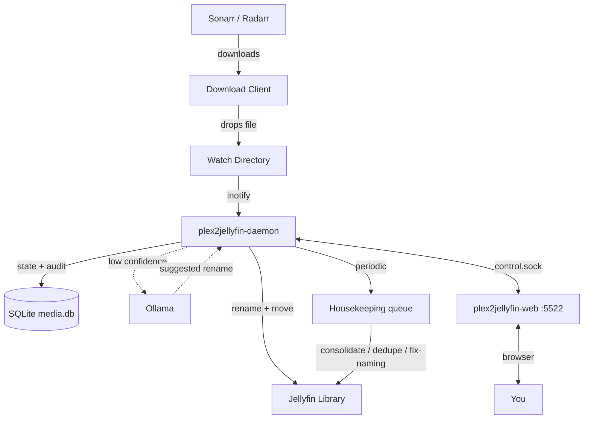

<div align="center">
  

  **Migrate your Plex library to Jellyfin. Keep it clean forever.**
</div>

---

> **Beta.** Every destructive operation runs as generate → dry-run → execute, so you can preview each change before it touches a file. Still: back up anything you can't re-download.

## Why this exists

I moved my Plex libraries to Jellyfin and watched Jellyfin shred them. Usenet and torrent releases name the same show a dozen different ways, and Plex spent years papering over that mess with fuzzy matching. Jellyfin takes your folder names at face value. One show splits into four entries because of release-group suffixes. Seasons land under "Season Unknown". Movies appear titled `1080p.BluRay.x265`.

Plex2Jellyfin is the tool I built to fix my own migration, then kept building. It takes the library Plex left behind, renames every file into the layout Jellyfin expects, merges the duplicates, consolidates series scattered across drives, and then stays running to guard the library as new downloads arrive. It is written in Go because mass-renaming tens of thousands of files needs to be fast, and it has organized my own multi-drive library daily since January 2026.

## What it does

**Migration (one-shot).** Point the CLI at your existing library:

```bash
plex2jellyfin scan                       # index everything into a local SQLite db
plex2jellyfin status                     # see what you have and what's broken
plex2jellyfin duplicates generate        # find the same content stored twice
plex2jellyfin duplicates dry-run         # preview which copies would be removed
plex2jellyfin duplicates execute         # keep the best copy, delete the rest
plex2jellyfin consolidate generate       # find series scattered across drives
plex2jellyfin consolidate execute        # merge each series onto one drive
plex2jellyfin audit --generate           # AI-assisted rename proposals for the stragglers
plex2jellyfin audit --execute            # apply approved fixes
```

When it finishes, Jellyfin scans a library it understands on the first pass: no duplicate show entries, no Season Unknown, no release-tag titles.

**Librarian (daemon).** After migration, `plex2jellyfin-daemon` watches your download directories. Sonarr or Radarr drops `Show.Name.S01E01.1080p.WEB-DL.x264-RARBG.mkv` into the watch folder; the daemon parses it, renames it to `TV Shows/Show Name (2019)/Season 01/Show Name (2019) S01E01.mkv`, moves it to the right drive, and tells Jellyfin. A convergence loop re-checks the library on a schedule and feeds anything drifting back toward chaos into a housekeeping queue you can review from the web dashboard.

Ambiguous filenames go to an optional local LLM (Ollama) behind a confidence threshold, a response cache, and a circuit breaker. The regex parser handles the bulk of files without ever calling it.

## What it does not do

Plex2Jellyfin migrates the media files themselves. Plex server metadata stays behind: user accounts, watch states, ratings, and playlists are out of scope.

## Architecture

Three binaries:

| Binary | Role |
|---|---|
| `plex2jellyfin` | CLI for migration: scan, audit, duplicates, consolidation, one-shot organize. The primary interface. |
| `plex2jellyfin-daemon` | Background daemon. Watches download dirs, runs the periodic library scan, executes the housekeeping queue, exposes a Unix-domain control socket. |
| `plex2jellyfin-web` | HTTP server (default `:5522`). Hosts the embedded dashboard and proxies API calls to the daemon over the control socket. **Work in progress**; the CLI and daemon carry the core workflow. |



See [`docs/architecture.md`](docs/architecture.md) for details.

## Install

**One-liner:**

```bash
curl -sSL https://raw.githubusercontent.com/Nomadcxx/plex2jellyfin/main/install.sh | sudo bash
```

**Manual:**

```bash
git clone https://github.com/Nomadcxx/plex2jellyfin.git
cd plex2jellyfin
go build -o installer ./cmd/installer
sudo ./installer
```

The installer walks you through watch paths, library paths, *arr keys, AI, permissions, and systemd units. Re-run it to update; it preserves your existing `config.toml`. Requires **Go 1.24+** to build from source.

### Docker

One image, three binaries: `plex2jellyfin-daemon` and `plex2jellyfin-web` run together under the entrypoint; the `plex2jellyfin` CLI is available for one-off commands (`docker run --rm <image> plex2jellyfin version`).

```bash
docker run -d \
  --name plex2jellyfin \
  -e PUID=1000 -e PGID=1000 \
  -v ./config:/config \
  -v /path/to/downloads:/watch \
  -v /path/to/media:/library \
  -p 5522:5522 \
  --restart unless-stopped \
  ghcr.io/nomadcxx/plex2jellyfin:latest
```

Or with [`docker-compose.example.yml`](docker-compose.example.yml):

```yaml
services:
  plex2jellyfin:
    image: ghcr.io/nomadcxx/plex2jellyfin:latest
    container_name: plex2jellyfin
    environment:
      - PUID=1000
      - PGID=1000
    volumes:
      - ./config:/config
      - /path/to/downloads:/watch
      - /path/to/media:/library
    ports:
      - "5522:5522"
    restart: unless-stopped
```

```bash
docker compose -f docker-compose.example.yml up -d
```

`PUID`/`PGID` (linuxserver.io-style, default `1000:1000`) set the user the daemon and web UI run as inside the container; `/config` is chowned to match on start. Config lives at `/config/.config/plex2jellyfin/config.toml`, same layout as a bare-metal install rooted at `$HOME`.

> **Note:** the container always runs as that non-root user, so the `[permissions]` chown feature (see [File Permissions](#file-permissions)) has nothing to elevate to and is unavailable in-container. Control file ownership with `PUID`/`PGID` instead — set them to match the UID/GID that should own files under `/library`.

## CLI Commands

`plex2jellyfin --help` shows the primary workflows. Advanced and maintenance commands exist but stay hidden from the root help.

### Primary

```bash
plex2jellyfin scan                        # Index libraries into media.db
plex2jellyfin status                      # DB statistics and deployment health
plex2jellyfin duplicates generate         # Find duplicate media
plex2jellyfin duplicates dry-run          # Preview deletion plan
plex2jellyfin duplicates execute          # Keep the best copy, remove the rest
plex2jellyfin consolidate generate        # Find TV series scattered across drives
plex2jellyfin consolidate dry-run         # Preview consolidation moves
plex2jellyfin consolidate execute         # Merge into a single library path
plex2jellyfin config                      # Manage configuration
```

### AI audit

Reviews files with low parse confidence and proposes renames via the configured LLM:

```bash
plex2jellyfin audit --generate            # Identify low-confidence files
plex2jellyfin audit --generate --dry-run  # Preview AI rename suggestions
plex2jellyfin audit --execute             # Apply approved fixes
```

The audit sends library kind (Movies vs TV), folder path, and current parse as context. See [`docs/ai-context.md`](docs/ai-context.md).

### Advanced (hidden from root help)

```bash
plex2jellyfin organize /downloads/file.mkv   # Organize a single file
plex2jellyfin organize-folder /downloads/X   # Organize a directory tree
plex2jellyfin watch /downloads               # Foreground watcher
plex2jellyfin validate <path>                # Check library against Jellyfin naming rules
plex2jellyfin cleanup                        # Remove cruft files / empty dirs
plex2jellyfin monitor                        # Tail daemon activity log
plex2jellyfin daemon {start|stop|restart}    # Control the systemd service
plex2jellyfin repair series-dedupe           # Repair duplicate series rows
plex2jellyfin postmortem collect --since 96h # Generate evidence bundle for review
plex2jellyfin sonarr ...                     # Sonarr integration commands
plex2jellyfin radarr ...                     # Radarr integration commands
plex2jellyfin health                         # Verify *arr setup is compatible
plex2jellyfin orphans                        # Detect / remediate orphaned Jellyfin episodes
```

## Web Dashboard

> **Work in progress.** Plex2Jellyfin is first a CLI tool and daemon; the dashboard trails behind them. Expect rough edges and prefer the CLI for anything destructive.

`plex2jellyfin-web` serves the dashboard at `http://<host>:5522/`. Routes:

- `/` — overview (media counts, duplicate groups, recent activity)
- `/queue` — current move queue
- `/scheduler` — periodic jobs + housekeeping task list (pending / running / flagged / failed / done)
- `/duplicates` — duplicate groups awaiting review
- `/consolidation` — TV consolidation plans
- `/activity` — daemon activity stream
- `/jellyfin` — Jellyfin connection + path-mapping status
- `/onboarding`, `/login`, `/settings/*` — first-run and configuration

Every settings page maps to a section of `~/.config/plex2jellyfin/config.toml`.

## Naming Rules

**Movies:** `Movies/Movie Name (YYYY)/Movie Name (YYYY).ext`

**TV Shows:** `TV Shows/Show Name (Year)/Season 01/Show Name (Year) S01E01.ext`

The parser strips release-group noise (`1080p`, `x264`, `WEB-DL`, `RARBG`, `-YTS`, etc.). It also extracts resolution, source, and HDR from the parent directory when the filename lacks them, so quality grouping works on legacy libraries.

## Configuration

Config file: `~/.config/plex2jellyfin/config.toml`. A full annotated template is in [`config.toml.example`](config.toml.example).

```toml
[watch]
movies = ["/downloads/movies"]
tv     = ["/downloads/tv"]

[libraries]
movies = ["/media/Movies"]
tv     = ["/media/TV Shows"]

[daemon]
enabled        = true
scan_frequency = "5m"
health_addr    = ":8686"

[ai]
enabled              = true
ollama_endpoint      = "http://localhost:11434"
model                = "minimax-m2.5:cloud"
fallback_model       = "kimi-k2.6:cloud"
confidence_threshold = 0.8
auto_trigger_threshold = 0.6
timeout_seconds      = 30
cache_enabled        = true
auto_resolve_risky   = false
max_retries          = 3
hourly_limit         = 10
daily_limit          = 50

[options]
dry_run          = false
delete_source    = true
```

### Sonarr / Radarr

```toml
[sonarr]
enabled          = true
url              = "http://localhost:8989"
api_key          = "..."
notify_on_import = true

[radarr]
enabled          = true
url              = "http://localhost:7878"
api_key          = "..."
notify_on_import = true
```

### Jellyfin path mappings

When Jellyfin runs in a container with bind mounts, configure path mappings so the post-organize feedback loop can correlate Jellyfin items with daemon paths:

```toml
[jellyfin]
enabled        = true
url            = "http://localhost:8096"
api_key        = "..."
webhook_secret = "..."

[[jellyfin.path_mappings]]
jellyfin = "/tv"
daemon   = "/mnt/storage1/TVSHOWS"
```

Without these, the sweeper labels parse-decision rows for organized files as FAIL.

### File Permissions

If Jellyfin runs as a different user, set ownership on moved files:

```toml
[permissions]
user      = "jellyfin"
group     = "jellyfin"
file_mode = "0644"
dir_mode  = "0755"
```

> **Note:** `plex2jellyfin-daemon` must run as root to chown files. The bundled systemd unit drops to a minimal capability set: `CAP_CHOWN`, `CAP_FOWNER`, `CAP_DAC_OVERRIDE`.

## Services

The installer registers three systemd units:

```bash
systemctl status plex2jellyfin-daemon                    # daemon
systemctl status plex2jellyfin-web                       # web UI on :5522
systemctl --user status plex2jellyfin-postmortem.timer  # scheduled evidence collection
journalctl -u plex2jellyfin-daemon -f
```

`plex2jellyfin-web` depends on `plex2jellyfin-daemon` and reaches it via the Unix-domain control socket. No TCP between them.

The postmortem timer runs every 4 days, collecting parse decisions, repair events, housekeeping state, and suspicious items into an evidence bundle at `~/.config/plex2jellyfin/reports/latest/`. Review it yourself or hand `agent-prompt.md` to an LLM.

## Building from source

```bash
make                                                    # build all binaries into bin/
go build -o bin/plex2jellyfin         ./cmd/plex2jellyfin
go build -o bin/plex2jellyfin-daemon  ./cmd/plex2jellyfin-daemon
go build -o bin/plex2jellyfin-web     ./cmd/plex2jellyfin-web
cd web && npm run build                                 # rebuild dashboard (embedded into plex2jellyfin-web)
./test-all.sh                                           # full test sweep
```

## License

GPL-3.0 or later
