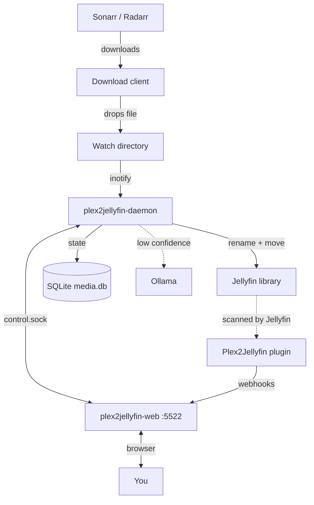

## Binaries

| Binary | Listens / runs | Responsibility |
|---|---|---|
| `plex2jellyfin` | foreground CLI | Migration commands, `setup`, `plugin`, one-shot organize |
| `plex2jellyfin-daemon` | systemd; Unix socket `control.sock` | inotify watch dirs, organize pipeline, periodic scan, housekeeping |
| `plex2jellyfin-web` | `:5522` HTTP | Embedded Next.js dashboard, setup wizard, API that talks to the daemon over the socket |
| Companion plugin | inside Jellyfin | Webhooks for item add/update/remove and playback → plex2jellyfin |

There is **no TCP** between web and daemon — only the Unix-domain control socket under `~/.config/plex2jellyfin/` (resolved via `SUDO_USER` when services run as root).

## Data flow

## Config and database

- **Config:** `~/.config/plex2jellyfin/config.toml` — see [Configuration](/docs/reference/configuration).
- **DB:** `~/.config/plex2jellyfin/media.db` — indexed media files, parse decisions, traces.
- **Setup marker:** `[setup] completed` / `version` — wizards set this when first-run finishes.

## Organize pipeline (daemon)

1. Detect new file under `[watch]`.
2. Parse filename (regex; optional AI if confidence is low).
3. Build Jellyfin-style destination under `[libraries]`.
4. Move/copy; optional `[permissions]` chown.
5. Notify Sonarr/Radarr / Jellyfin when configured.
6. Record parse decision; sweeper + plugin webhooks confirm Jellyfin actually ingested the item.

Path mappings (`[[jellyfin.path_mappings]]`) are required when Jellyfin’s container paths differ from host paths — otherwise confirmations fail. See [Path mappings](/docs/getting-started/path-mappings).

### First organize → confirmation → labels

1. Daemon organizes a file under a `[libraries]` root and records a `parse_decisions` row.
2. Companion plugin posts an item-added/updated webhook with Jellyfin’s path (often a container root).
3. Path translator rewrites that path to the daemon view; the webhook handler attaches `jellyfin_item_id` (and provider IDs) when correlation succeeds.
4. Labeler compares the parsed title to Jellyfin’s name → **PASS** / **DRIFT** / **FAIL**. Without plugin webhooks or without mappings, step 3 never attaches IDs and labels do not run.

## Initial library scan

Used by setup wizards (and `plex2jellyfin scan`) to walk library roots into `media.db`. Progress is reported per library. A **soft stall timeout** (~12 minutes without walk progress) skips a hung mount and continues with remaining libraries so one dead NFS share cannot wedge the whole index.

## Safety model

Destructive migration commands use **generate → dry-run → execute**. Preview plans before touching files. The daemon always organizes for real — it ignores `[options].dry_run` (forced off at startup).
