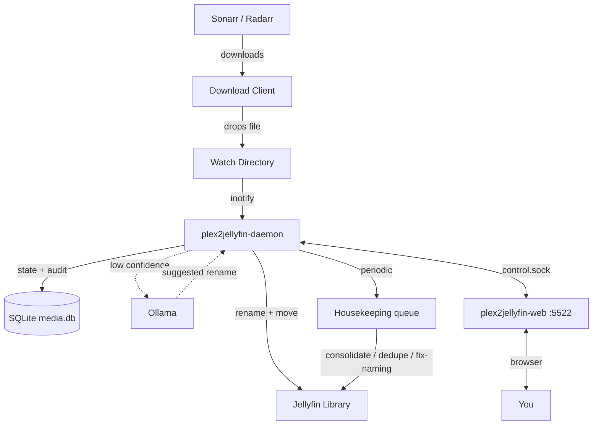

# Plex2Jellyfin

**Migrate your Plex library to Jellyfin. Keep it clean forever.**

!!! warning "Beta"
    Every destructive operation runs as generate &rarr; dry-run &rarr; execute, so you can preview each change before it touches a file. Still: back up anything you can't re-download.

## Why this exists

Plex spent years papering over messy release-group naming with fuzzy matching. Jellyfin takes your folder names at face value: a show can split into four entries because of release-group suffixes, seasons land under "Season Unknown", and movies show up titled `1080p.BluRay.x265`.

Plex2Jellyfin is the tool built to fix that migration, then kept running. It takes the library Plex left behind, renames every file into the layout Jellyfin expects, merges duplicates, consolidates series scattered across drives, and then stays running to guard the library as new downloads arrive. It's written in Go because mass-renaming tens of thousands of files needs to be fast.

## What it does

**Migration (one-shot).** Point the CLI at your existing library:

```bash
plex2jellyfin scan                       # index everything into a local SQLite db
plex2jellyfin status                     # see what you have and what's broken
plex2jellyfin duplicates generate        # find the same content stored twice
plex2jellyfin duplicates dry-run         # preview which copies would be removed
plex2jellyfin duplicates execute         # keep the best copy, delete the rest
plex2jellyfin consolidate generate       # find series scattered across drives
plex2jellyfin consolidate execute        # merge each series onto one drive
plex2jellyfin audit --generate           # AI-assisted rename proposals for the stragglers
plex2jellyfin audit --execute            # apply approved fixes
```

When it finishes, Jellyfin scans a library it understands on the first pass: no duplicate show entries, no Season Unknown, no release-tag titles.

**Librarian (daemon).** After migration, `plex2jellyfin-daemon` watches your download directories. Sonarr or Radarr drops `Show.Name.S01E01.1080p.WEB-DL.x264-RARBG.mkv` into the watch folder; the daemon parses it, renames it to `TV Shows/Show Name (2019)/Season 01/Show Name (2019) S01E01.mkv`, moves it to the right drive, and tells Jellyfin. A convergence loop re-checks the library on a schedule and feeds anything drifting back toward chaos into a housekeeping queue reviewable from the web dashboard.

Ambiguous filenames go to an optional local LLM (Ollama) behind a confidence threshold, a response cache, and a circuit breaker. The regex parser handles the bulk of files without ever calling it.

## What it does not do

Plex2Jellyfin migrates the media files themselves. Plex server metadata stays behind: user accounts, watch states, ratings, and playlists are out of scope.

## Architecture

Three binaries:

| Binary | Role |
|---|---|
| `plex2jellyfin` | CLI for migration: scan, audit, duplicates, consolidation, one-shot organize. The primary interface. |
| `plex2jellyfin-daemon` | Background daemon. Watches download dirs, runs the periodic library scan, executes the housekeeping queue, exposes a Unix-domain control socket. |
| `plex2jellyfin-web` | HTTP server (default `:5522`). Hosts the embedded dashboard and proxies API calls to the daemon over the control socket. **Work in progress**; the CLI and daemon carry the core workflow. |



## Naming rules

**Movies:** `Movies/Movie Name (YYYY)/Movie Name (YYYY).ext`

**TV Shows:** `TV Shows/Show Name (Year)/Season 01/Show Name (Year) S01E01.ext`

The parser strips release-group noise (`1080p`, `x264`, `WEB-DL`, `RARBG`, `-YTS`, etc.) and extracts resolution, source, and HDR from the parent directory when the filename lacks them, so quality grouping works on legacy libraries.

## Where to go next

- [Installation](getting-started/installation.md) — script, manual build, or deb/rpm packages
- [Docker](getting-started/docker.md) — container deployment, volumes, and permissions (read this if you're running in Docker)
- [Migration Guide](getting-started/migration-guide.md) — the scan &rarr; status &rarr; duplicates &rarr; consolidate &rarr; audit workflow
- [CLI Reference](reference/cli.md) — every command
- [Configuration](reference/configuration.md) — `config.toml` reference
- [Daemon & Services](reference/daemon-services.md) — systemd units and the postmortem timer
- [Troubleshooting](troubleshooting.md)

## License

GPL-3.0 or later.
